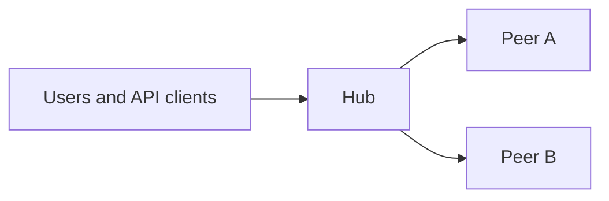
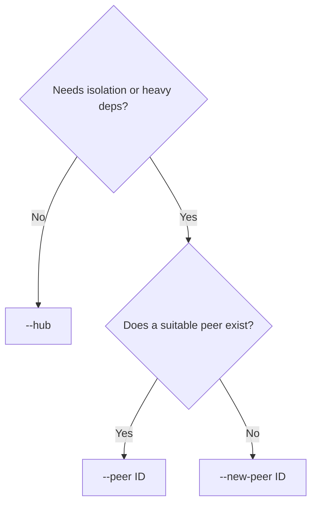

# Arbitium CLI

`arbitium` is the operator command for an Arbitium system: bring a tenant up, keep its stacks current, manage sender email and operators, invite collaborators, and install extensions.

It is not the release-train tool and not the package publisher. After an extension is product, later versions ride the normal release process.

```bash
arbitium help
arbitium help system          # one family
arbitium status               # where you are, and the next command
arbitium doctor               # this machine is ready
```

Every command accepts `--json`. Most commands that change AWS accept `--dry-run`. Destructive steps need `--yes`.

---


## Install Operator Local Environment

Once per operator machine. Python 3.12 and the AWS CDK CLI (`npm install -g aws-cdk`) must already be on `PATH`. You also need an AWS CLI profile that can reach the tenant account.

```bash
cd ops/arbitium-cli            # or the arbitium-cli checkout
bash setup_venv.sh
source arbitium-venv/bin/activate
arbitium doctor
```

The venv is named `arbitium-venv` on purpose. With it active you can run `arbitium` from any folder inside the workspace — it walks up until it finds one.

Alternatively:

```bash
pipx install --pip-args '--isolated --index-url https://pypi.org/simple' -e /path/to/arbitium-cli
```


### Global flags


| Flag               | Meaning                                                                    |
| ------------------ | -------------------------------------------------------------------------- |
| `--json`           | Machine-readable output. Works on every command.                           |
| `--workspace PATH` | Workspace root, if you are not already inside it.                          |
| `--profile NAME`   | AWS CLI profile. Stored on an in-progress install so later steps reuse it. |
| `--region REGION`  | AWS region. Defaults to the active install, then the tenant.               |
| `--dry-run`        | Print what would run. On AWS mutators.                                     |
| `--yes`            | Confirm destroy / push.                                                    |


`arbitium status` always prints a `next:` line. If you lose your place, start there.

---


## What you are operating

An Arbitium deployment is one **hub** plus any number of **peers**.




The **hub** is the API every client talks to. It authenticates requests and routes work.

A **peer** is a worker with its own compute and permissions. The hub forwards a job and gets a result back. Peers do not talk to clients.

A **handle** is the short name of an extension (`data`, `schd`, `arbitiumtriage, arbitiumlab`). Routing uses the handle. An extension runs in exactly one place: on the hub, or on one peer — never both.

Two AWS CloudFormation platform stacks sit under that:


| Stack | What it is                                   | When you touch it                          |
| ----- | -------------------------------------------- | ------------------------------------------ |
| **A** | Core platform: auth, storage, identity, mail | New tenant, or an explicit core change     |
| **B** | Hub-side extension infrastructure            | Hub-placed extensions, blueprints, hub IAM |


GitHub OIDC (so CI can assume a role in this account) is created automatically the first time stack A deploys and the provider is missing.

---


## Golden Paths

The following processes are supported by the CLI 

### a. Initialize the system

This process is executed when you need a brand new instance of Arbitium. Multiple environments can coexist in a single AWS account.

```text
arbitium system init --env-name NAME --github-repo ORG/BOM \
  --email-from ADDR --email-identity-type domain
arbitium system install start --profile PROFILE
arbitium system install apply
```

`install apply` builds the account, deploys stack A then stack B, and registers running URLs.

```text
arbitium email allow teammate@example.com
arbitium email verify-sender
arbitium admin create you@example.com
```

Assign email accounts that can receive emails from the system during development. Check they have verified and approved their emails. Seed the first admin user.

```text
arbitium state local-config
```

`local-config` generates the config file that developers need to work with the system from their local environments

Then start the local API (or wait for the hosted one) and invite people with `arbitium user invite`. Preferably, the admin user should generate a portfolio and invite users directly from the platform. 

### b. Redeploy A and/or B

During development, new features might require additional infrastructure. The CloudFormation and CDK application will be modified (Infrastructure as Code) to have the added elements. The operator will have to regenerate the CloudFormation templates (synth) and deploy them: 

```text
arbitium system synth
arbitium stack deploy --stack a,b --write-state
```

Alternatively, the same process can be executed one stack at a time plus the state write:

```text
arbitium system synth
arbitium stack deploy --stack a
arbitium stack deploy --stack b
arbitium state write
```

Register variables (state write) only when you intend to.

### c. Add a new extension

Decide placement first (hub, existing peer, or a new peer), then:

```text
arbitium extension install place HANDLE --peer lab --profile PROFILE
arbitium extension install plan
arbitium extension install config
arbitium extension install pin
arbitium extension install publish
arbitium extension install deploy
arbitium extension install test
arbitium extension install push
arbitium extension install finish
```

`deploy` never touches stack A. Hub placement deploys stack B; peer placement deploys that peer.

### d. Update a peer stack (no new extension)

```text
arbitium peer list
arbitium peer deploy --peer-id lab --write-state
```

`peer deploy` executes the infrastructure changes in the peer (this is not the code deployment)

### Tear down

```text
arbitium system destroy --yes          # B, then A
arbitium stack destroy --stack b --yes
arbitium peer destroy --peer-id lab --yes
```

Destroying A while B still exists is refused. Destroy B first, or pass `--stack a,b`.

---


## Command reference


### `arbitium help [topic]`

Lists nouns and verbs. `arbitium help system` (and `stack`, `state`, `email`, `admin`, `user`, `extension`, `peer`) lists one family. `arbitium system help` is the same.

### `arbitium status`

Env name, stack A/B health, registered sender and URLs, whether a system install or extension install is in progress, and the next command.

Use this whenever you are unsure.

### `arbitium doctor`

Checks this machine: Python 3.12, CDK CLI, the platform venv, AWS `sts` for the chosen profile, and that the workspace looks complete. Extension and peer commands also need the product tree (BOM + `extensions/`).

---


### `system` — new tenant

Minimum workspace: platform only.

#### `arbitium system init`

Writes the tenant identity from flags. Does not deploy anything.


| Flag                          | Required | Meaning                                              |
| ----------------------------- | -------- | ---------------------------------------------------- |
| `--env-name NAME`             | yes      | Short name of this installation (stack prefix).      |
| `--github-repo ORG/BOM`       | yes      | GitHub repo that owns this tenant's pins.            |
| `--email-from ADDR`           | yes      | Sender address (or an address on the sender domain). |
| `--email-identity-type domain | email`   | yes                                                  |
| `--email-hosted-zone-id ID`   | no       | Route 53 zone, when DNS is automatic.                |
| `--enable-staging`            | no       | Also create a staging environment.                   |


Does not place extensions. Hub compute is always Lambda. Peer Fargate/EC2 is catalog config, not a flag here.

#### `arbitium system synth`

Generates the CloudFormation apps for this env. Run this after `init`, and again before any later `stack deploy`.

#### `arbitium system cdk-bootstrap`

One-time CDK bootstrap of the AWS account/region. Safe to re-run. Needed before the first stack deploy in that account.

#### `arbitium system destroy [--yes]`

Tears down stack B, then stack A. Requires `--yes` (or `--dry-run`). Peer stacks are not included — destroy those with `arbitium peer destroy`.

#### `arbitium system install start --profile PROFILE`

Opens a system-install session. The profile is remembered for the remaining phases.

#### `arbitium system install plan`

Read-only. Remaining phases: synth, cdk-bootstrap, OIDC (auto on A), stack A, stack B, register variables. SES and admin are listed as *after* apply, not inside it.

#### `arbitium system install apply [--through write-state]`

Runs remaining infra phases up to `--through` (default: register variables). Stops before sender verification and admin create.

Resume by running `apply` again; completed phases are skipped.

---


### `stack` — the loop you rerun


#### `arbitium stack status [a|b]`

CloudFormation status for A, B, or both.

#### `arbitium stack deploy --stack a|b|a,b`


| `--stack` | What deploys                                                                                                  |
| --------- | ------------------------------------------------------------------------------------------------------------- |
| `a`       | Core platform only. Creates GitHub OIDC if it is missing, unless you pass `--create-github-oidc` to force it. |
| `b`       | Hub extension infrastructure only.                                                                            |
| `a,b`     | A, then B.                                                                                                    |


`--write-state` registers URLs and sender after the deploy. Default **off**. `--dry-run` prints the CDK commands.

You must pass `--stack`. There is no default.

#### `arbitium stack destroy --stack a|b|a,b [--yes]`

Same letters. Refuses A-before-B. `--yes` required.

---


### `state` — registered variables

These are the values the running system uses: sender, API URL, console URL.

#### `arbitium state show`

Prints `FROM_EMAIL`, `FE_BASE_URL`, `BASE_URL`, `AMPLIFY_CONSOLE_URL`.

#### `arbitium state write [--dry-run]`

Publishes those values from the live stacks. Run after a deploy that changed URLs or sender, unless you already passed `--write-state`.

#### `arbitium state local-config`

Writes the files needed to run the API and console on this laptop. Do this once after the first install, and again if URLs or pool ids changed.

---


### `email` — sending mail

SES starts in **sandbox**: you can only send to addresses you have allowed. `status` prints the AWS URL for requesting production access; this CLI does not file that ticket.

#### `arbitium email status`

From-address, DNS mode, verification, sandbox vs production.

#### `arbitium email verify-sender`

Waits on / re-checks domain verification, or resends the inbox confirmation when the sender is a single mailbox.

#### `arbitium email allow ADDRESS`

Sandbox recipient whitelist. The recipient must click the SES confirmation mail. No-op if the account already has production access.

Allow every address you will invite until production access is granted.

---


### `admin` — Cognito operators

This is **not** the in-app invite funnel. Self-signup stays disabled. Use this for the first operator (and extra operators who should exist in the user pool before the app is up).

#### `arbitium admin create EMAIL`

Creates the Cognito user and prints hosted and local setup URLs (`/invite?setup=admin&email=`). Cognito emails a temporary password. Complete setup at that URL before using the account as `--admin-email` on `user invite`.

#### `arbitium admin show EMAIL`

Pool lookup: exists, status, enabled.

---


### `user` — collaborators via the running app

Needs a live API (local or hosted) and an admin who has finished setup.

#### `arbitium user invite EMAIL --team TEAM --portfolio PORTFOLIO`

`POST /_auth/user/invite`. Refuses if SES is still in sandbox and the address has not been allowed.


| Flag                                 | Meaning                                                                        |
| ------------------------------------ | ------------------------------------------------------------------------------ |
| `--api-url URL`                      | API root. Defaults to the registered `BASE_URL`, else `http://127.0.0.1:5001`. |
| `--token TOKEN`                      | Admin bearer token.                                                            |
| `--admin-email` / `--admin-password` | Sign in as that admin instead of passing `--token`.                            |


There is no `arbitium auth login` in this version. Pass a token or the admin email and password each time.

---


### `extension` — one-time install of a new feature

Minimum workspace: the product tree (BOM + `extensions/<handle>/`). Stack A and B must already exist. You do not deploy stack A here.

An extension is code + (usually) its own AWS resources + an IAM policy. The policy is attached to **whatever machine runs it**. Hub placement → hub role. Peer placement → that peer's roles only. Access follows placement.

Three placements:




| Placement     | Flag               | What happens                                                |
| ------------- | ------------------ | ----------------------------------------------------------- |
| Hub           | `--hub`            | Code ships inside the API. Use sparingly: one blast radius. |
| Existing peer | `--peer lab`       | Joins that peer's package and roles. Most common.           |
| New peer      | `--new-peer audio` | New worker stack that initially hosts only this handle.     |


`--compute` (`fargate`, `ec2`, `lambda_only`) and `--task-size` apply to `--new-peer`. `lambda_only` has no container runners.

Before `place`: the handle's installer files and a buildable Python package must already exist under `extensions/<handle>/`. Declaring a bucket does not grant access — the policy document must list the actions.

The install is a sheet: `placed → configured → pinned → published → deployed → tested → pushed`, then `finish` clears it. `plan` does not advance the sheet.

#### `arbitium extension status`

Current incubation, if any, and the next command. Works with no sheet: tells you to `place`.

#### `arbitium extension show HANDLE`

Owner, package name, product vs incubating, installer files present.

#### `arbitium extension tree`

Every catalog handle and the machine that owns it.

#### `arbitium extension install place HANDLE --hub|--peer PEER|--new-peer PEER --profile PROFILE`

Starts the install. Refuses if the handle is already in the catalog or already product. Marks the extension incubating so release trains skip it until `finish`.

`--profile` is stored and reused. Optional: `--region`, `--python-version`, `--npm`, `--compute`, `--task-size`.

#### `arbitium extension install plan`

Read-only preview of catalog edits, the pin it will create, and the deploy it will run.

#### `arbitium extension install config`

Records placement. Does not change tenant identity. Does not deploy.

#### `arbitium extension install pin [--python-version X.Y.Z] [--npm-version X.Y.Z]`

Creates a **new** version file and points the catalog at it. Never edits the current pin in place. Default Python version comes from the package.

#### `arbitium extension install publish [--skip-upload]`

Builds the first wheel and uploads it. Later versions are the publisher + release train, not this command. `--skip-upload` builds only.

#### `arbitium extension install deploy [--dry-run]`

Creates the extension's buckets, indexes, and IAM, attaches the policy to the owning machine, then registers routes/variables.


| Placement     | What deploys                      |
| ------------- | --------------------------------- |
| Hub           | Stack B                           |
| Existing peer | That peer stack                   |
| New peer      | The new peer stack (created here) |


**Never stack A.** `--dry-run` prints the commands.

#### `arbitium extension install test [--skip-synth]`

Installer files present, and the handle has exactly one owner. A handle on both the hub and a peer (or two peers) fails here.

#### `arbitium extension install push [--yes] [--no-push]`

Commits and pushes the BOM. That is the only hand-push for this extension; afterwards the release train owns it. `--yes` skips the prompt. `--no-push` commits locally only.

#### `arbitium extension install finish`

Marks the extension product, refreshes membership, deletes the sheet. Refuses unless `test` passed and you have pushed.

Do not run `pin` / `publish` / `push` again for this handle. The CLI refuses once it is product.

---


### `peer` — update a worker without an incubation sheet

Same helper `extension install deploy` uses on a peer path. Use these when the peer already exists and you are not installing a new handle.

#### `arbitium peer list`

Every peer, compute mode, and the handles on it.

#### `arbitium peer show PEER`

One peer: compute, extensions, pin pointer.

#### `arbitium peer synth --peer-id PEER`

Generate that peer's CloudFormation app.

#### `arbitium peer deploy --peer-id PEER [--write-state] [--dry-run]`

Deploy (or update) that peer stack. `--write-state` refreshes routes/variables. Does not touch stack A or other peers.

#### `arbitium peer destroy --peer-id PEER [--yes]`

Tear that peer stack down. `--yes` required.

---


## What this CLI does not do

- Release trains, hotfixes, or BOM regeneration (that is the convoy / publisher path)
- Publishing wheels after the first one
- Filing the SES production-access request (status prints the URL)
- A saved login session (`user invite` takes a token or admin email/password each time)
- Operator IAM policy helpers
- Overflow teardown or Amplify deploy

